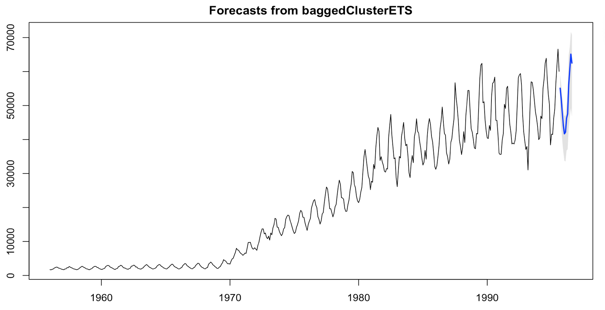

# tshacks

This package creates Time Series Hacks to enhance time series problems, such as forecasting, scenario generation among others. List of methods:

- [Bagged.Cluster.ETS](Bagged.md)
- TBA

### How to use it

First, I haven't uploaded a stable version to CRAN but you can download from GitHub using devtools, type:

```r
library(devtools)
install_github("tiagomendesdantas/tshacks")
```

## Then, load the package and start using it:
```r
library(tshacks)
method <- baggedClusterETS(gas)
f_method <- forecast(method,h=12)
plot(f_method)
```

<center></center>


